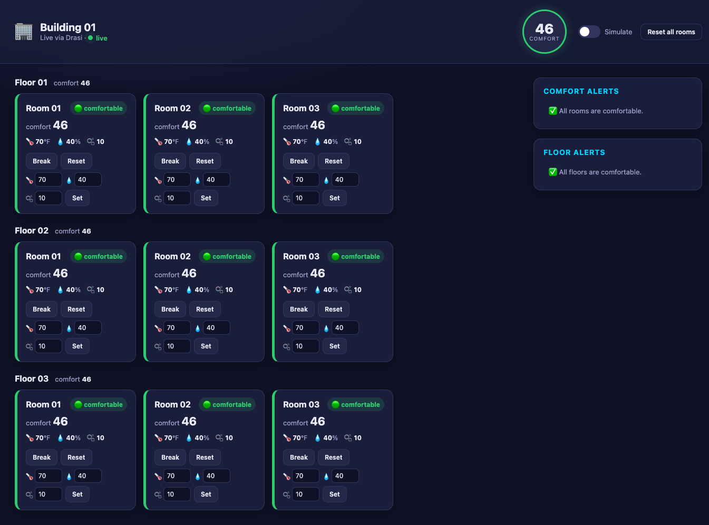
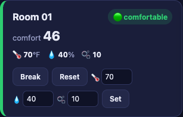
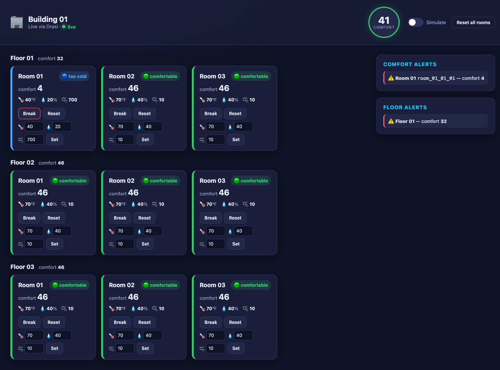
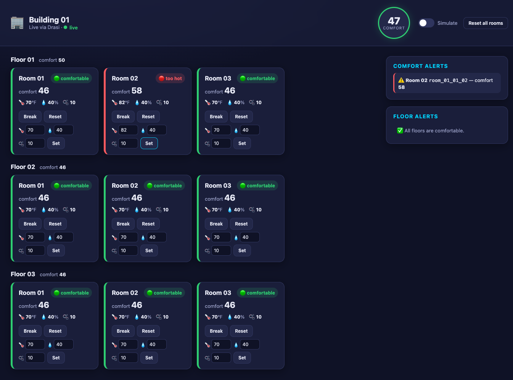
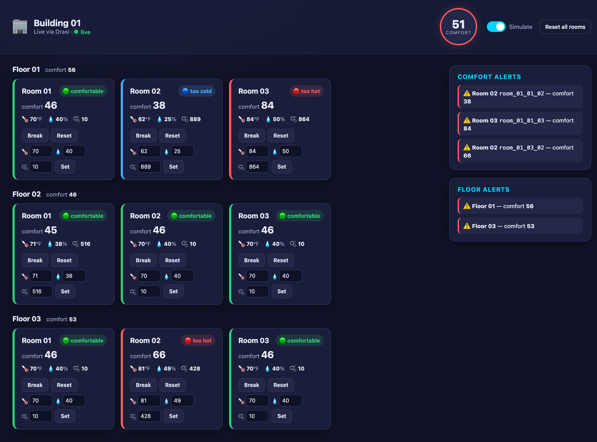

Imagine you manage a building and want to know — the instant it happens — when any
room becomes uncomfortable: too hot, too cold, or stuffy with CO2. You don't want to
poll sensors on a timer or wire up a stream processor by hand. You just want to
describe what "uncomfortable" means and have something watch every room, floor, and
the whole building for you, continuously.

This tutorial builds a **Building Comfort** monitoring app on **`@drasi/lib`**, the
Node.js library that embeds the Drasi continuous-query engine directly in your process.
A PostgreSQL database holds a building made of floors and rooms, each room reporting
`temperature`, `humidity`, and `co2`. A single Node app connects to the database, runs
six continuous queries, and streams the results to a live web UI over
[Server-Sent Events](https://developer.mozilla.org/en-US/docs/Web/API/Server-sent_events).
You'll change room readings and watch everything react in real time.

Unlike the [Drasi Server tutorial](https://github.com/drasi-project/learning-drasi-server)
this is based on, there is no separate server to run and no built-in *dashboard* reaction.
Instead, the app embeds the engine and adds Drasi's **SSE reaction** (`kind: sse`): it shapes
each query change with **Handlebars** templates and streams it to the browser over Server-Sent
Events, driving a custom web UI. That UI adds controls the dashboard reaction doesn't have —
**toggle a simulator**, and **reset or set any room** — all from the page.

**What you'll build:** a running Node app that embeds Drasi, connects to PostgreSQL, and
reacts to room sensor changes in real time, assembled from Drasi's three core building
blocks:

<div class="flow-diagram">
  <div class="flow-step">
    <div class="flow-step__icon">
      <i class="fas fa-database"></i>
    </div>
    <div class="flow-step__label">Sources</div>
    <div class="flow-step__description">Connect to your data sources</div>
  </div>

  <div class="flow-arrow">
    <i class="fas fa-arrow-right"></i>
  </div>

  <div class="flow-step">
    <div class="flow-step__icon">
      <i class="fas fa-filter"></i>
    </div>
    <div class="flow-step__label">Continuous Queries</div>
    <div class="flow-step__description">Define what changes matter</div>
  </div>

  <div class="flow-arrow">
    <i class="fas fa-arrow-right"></i>
  </div>

  <div class="flow-step">
    <div class="flow-step__icon">
      <i class="fas fa-bolt"></i>
    </div>
    <div class="flow-step__label">Reactions</div>
    <div class="flow-step__description">Take action automatically</div>
  </div>
</div>

| Step | What You'll Do | Time |
| ---- | ------------- | ---- |
| **[Step 1: Set Up Your Environment](#setup)** | Open the dev container (or install Node + Docker locally) | 5 min |
| **[Step 2: Run the Demo](#run)** | One command starts PostgreSQL and the app | 3 min |
| **[Step 3: Open the UI](#ui)** | Watch comfort levels and alerts live | 2 min |
| **[Step 4: Drive Change](#drive)** | Break, reset, set, and simulate rooms — and watch Drasi react instantly | 5 min |
| **[How It Works](#how)** | Understand the source, the six queries, the synthetic joins, and the SSE reaction | 5 min |

{}
- **Terminal:** you'll use one to run the app (it stays in the foreground). Everything
  else happens in your **browser**. You can optionally use a second terminal for the
  helper scripts that change data.
- **Working directory:** run every command from the tutorial directory
  (`tutorials/building-comfort/`). The dev container opens there automatically; if
  you're running locally, `cd tutorials/building-comfort` first.
- **Ports:** the web UI is on `3000` and PostgreSQL is published on `5732`. The SSE reaction
  runs inside the app on `8081`, but the app multiplexes it into the UI's `/events` stream, so
  only `3000` needs to be reachable.
{}

## Step 1 of 4: Set Up Your Environment {#setup}

The easiest way to follow this tutorial is the **dev container**, which installs
everything for you. You can also run locally if you prefer.

### Option A: Dev Container or GitHub Codespaces (recommended)

This repo has several tutorial dev containers. Codespaces does **not** ask which one to use
if you click **Create codespace** on the default **Code** menu — pick the configuration
explicitly (or use the link below).

1. **GitHub Codespaces:** Open
   [this Codespaces link](https://codespaces.new/drasi-project/drasi-nodejs?devcontainer_path=.devcontainer/building-comfort/devcontainer.json)
   (it selects **Drasi Node.js — Building Comfort Tutorial** for you).

   Or from the repo page: **Code** → **Codespaces** → **…** next to **Create codespace on
   main** → **New with options…**, set **Dev container configuration** to **Drasi Node.js —
   Building Comfort Tutorial**, then create the codespace.

2. **VS Code (local):** Open the
   [`drasi-nodejs`](https://github.com/drasi-project/drasi-nodejs) repository and run
   **Dev Containers: Reopen in Container**. When prompted for a configuration, choose
   **Drasi Node.js — Building Comfort Tutorial**.

3. Wait for the container to finish. Its setup script installs Node dependencies for the
   tutorial.

That's it — skip ahead to [Step 2](#run).

### Option B: Run Locally

You'll need **Node.js 18+**, **Docker** (for PostgreSQL), and **bash** (for the optional
helper scripts; on Windows use Git Bash or WSL). From the repository root, move into the
tutorial directory and install its dependencies:

```bash
cd tutorials/building-comfort
npm install
```

`@drasi/lib` ships **prebuilt binaries**, so there's no Rust toolchain to install — npm
resolves the correct native addon for your platform. (Intel macOS has no prebuilt binary
and must build from source; see the [library docs](https://drasi-project.github.io/drasi-nodejs/).)

## Step 2 of 4: Run the Demo {#run}

Everything runs from a single command. In your terminal, start the demo:

```bash
npm run demo
```

`npm run demo` does two things: it starts PostgreSQL (seeding one building, three floors,
and nine rooms — every room comfortable to begin with) and then runs the Node app in the
foreground.

On first start, the app downloads the Drasi plugins it needs (`source/postgres`,
`bootstrap/postgres`, and `reaction/sse`) from `ghcr.io/drasi-project` with `installPlugin`, which
resolves each one to the build that matches your platform **and** this library version, connects to
the database, and starts the six continuous queries and the SSE reaction. When you see this line,
it's ready:

```text
✅ Building Comfort is ready — open http://localhost:3000
```

Leave this running. Everything else happens in your **browser** (or an optional second
terminal).

{}
Press **Ctrl+C** in the terminal to stop the app. To remove the database container when
you're completely done, run `bash scripts/cleanup.sh` (add `--volumes` to also delete the
data). The database keeps running between app restarts, so you can stop and start the app
freely.
{}

## Step 3 of 4: Open the UI {#ui}

The app serves its own web UI — there's no separate front end to build or run. **Wait
until the terminal prints `Building Comfort is ready`** (on the first run this takes
~30 seconds while the plugins download), then open it in your browser:

```text
http://localhost:3000
```

In the dev container or Codespaces, port `3000` is forwarded automatically — VS Code
shows a notification when the UI is ready, and you can also open it from the **Ports**
panel (the **Comfort UI** entry). If you open the page before the app has finished
starting, just refresh once it's ready.

You'll see the **Building Comfort** UI:



- **The building** (the large panel) — rooms grouped by floor, each showing its comfort
  level, a status badge, and its sensor readings. Every room starts at comfort `46`
  (comfortable). Each room card also has **Break**, **Reset**, and **Set** controls.
- **Overall comfort** — the gauge in the header shows the building's average comfort
  level, tinted green, red, or blue.
- **Comfort Alerts** and **Floor Alerts** — empty for now; rooms and floors appear here
  only when they need attention.
- **Simulate** toggle and **Reset all rooms** button — in the header.

Each room card carries its own controls — the readings, a live comfort level, and
**Break** / **Reset** / **Set**:



The UI updates the instant the data changes — no refreshing. Let's make something change.

## Step 4 of 4: Drive Change {#drive}

With the app running and the UI open, change room readings from the UI and watch every
panel react.

{}
Every control in the UI does exactly one thing: a plain SQL `UPDATE` against PostgreSQL —
exactly what an existing building-management app would already do. The button posts to the
app, which runs the `UPDATE`; there's **no event to publish and no call into Drasi**. Drasi
observes the row change through PostgreSQL's logical replication (CDC), re-evaluates the
affected queries, and the SSE reaction re-shapes and pushes the snapshot on its own.
{}

### Break a room

Click **Break** on any room card. It pushes that room out of the comfortable band (sets
`temperature = 40`, `humidity = 20`, `co2 = 700`).

Within about a second the whole UI reacts: the room's card turns blue (too cold — its
comfort level drops to `4`), its floor's average falls, the header gauge drops, and entries
appear in **Comfort Alerts** and **Floor Alerts**. The browser computed none of that — each
panel is a continuous-query result the SSE reaction shaped and pushed.



### Set custom values

Each room card has three inputs (🌡️ / 💧 / 🫧) and a **Set** button. Try *partial*
degradation — make a room too hot without touching humidity or CO₂: set the temperature to
`82` and click **Set**. That gives `50 + (82-72) + (40-42) + 0 = 58` — above `50`, so the
room turns red and raises a **Comfort Alert**, while its floor (whose average is exactly
`50`) stays just inside the band and raises no **Floor Alert**.



### Reset a room (or all rooms)

Click **Reset** on a room card to return it to comfortable defaults (`70 / 40 / 10`), or
**Reset all rooms** in the header to reset the whole building. The alerts clear and every
panel returns to green.

### Let it run hands-free

Flip the **Simulate** toggle in the header. The app picks a random room every few seconds
and assigns new readings, so comfort levels rise and fall and alerts come and go on their
own — a live stress test of the whole pipeline. Flip it off to stop, then click **Reset all
rooms**.



{}
Because every change is just a database write, you can drive the exact same reactions with
`psql` from a second terminal — no app endpoint involved:

```bash
docker exec building-comfort-nodejs-postgres psql -U drasi_user -d building_comfort \
  -c "UPDATE \"Room\" SET temperature = 40, humidity = 20, co2 = 700 WHERE id = 'room_01_01_01';"
```

Watch the UI react exactly as if you had clicked **Break**.
{}

## How It Works {#how}

Everything you just ran is a single Node app under `tutorials/building-comfort/`. One file,
`index.mjs`, embeds the engine, builds the topology, wires the SSE reaction, and serves the
UI (the browser front end lives in `public/`). Here's what each part does.

### The Source

The app connects a PostgreSQL **CDC source** to the `Building`, `Floor`, and `Room`
tables:

```js
await engine.addSource('postgres', 'building-facilities', {
  host: 'localhost',
  port: 5732,
  database: 'building_comfort',
  user: 'drasi_user',
  password: 'drasi_password',
  tables: ['Building', 'Floor', 'Room'],
  slotName: 'drasi_building_comfort_slot',
  publicationName: 'drasi_building_comfort_pub',
  tableKeys: [
    { table: 'Building', keyColumns: ['id'] },
    { table: 'Floor', keyColumns: ['id'] },
    { table: 'Room', keyColumns: ['id'] },
  ],
}, true, { kind: 'postgres', config: /* same */ });
```

The source uses **logical replication (CDC)** to stream changes, and `tableKeys` tells
Drasi the primary key of each table so it can track row identity. The bootstrap provider
(`{ kind: 'postgres' }`) loads the rows that already exist when the app starts; after
that, every `UPDATE` flows to Drasi as a change. The table names are quoted and PascalCase
in the database so the node labels Drasi sees match the queries exactly: `(r:Room)`,
`(f:Floor)`, `(b:Building)`.

### The Continuous Queries

Each query computes a **comfort level** with the same formula. A value between **40 and
50** is comfortable; the seed values (70°F, 40%, 10 ppm) give
`50 + (70-72) + (40-42) + 0 = 46`.

```cypher
floor( 50 + (r.temperature - 72) + (r.humidity - 42)
      + CASE WHEN r.co2 > 500 THEN (r.co2 - 500) / 25 ELSE 0 END )
```

There are six queries, each registered with its own `addQuery` call:

| Query | What it returns |
| ----- | --------------- |
| `building-comfort-ui` | One row per room with its comfort level — the feed that drives the building view |
| `building-comfort-level-calc` | The building's overall comfort level |
| `floor-comfort-level-calc` | Each floor's average comfort level |
| `room-alert` | Only the rooms whose comfort is outside 40–50 |
| `floor-alert` | Only the floors whose average comfort is outside 40–50 |
| `building-alert` | The building, when its overall comfort is outside 40–50 |

The SSE reaction streams five of these — the per-room feed, the per-floor and building comfort
rollups, and the room and floor alerts — to the UI, each on its own path (`building-alert`
isn't shown in this UI). The floor and building queries are **aggregations**: `avg()` inside a
`WITH` rolls room comfort up to floors and the building, and the reaction streams their changes
just like any other query.

#### Synthetic joins connect the entities

PostgreSQL knows `Room.floor_id` references `Floor.id` through a foreign key, but Drasi
doesn't read foreign keys. Instead, each query **declares** the relationships it needs as
synthetic joins, so the Cypher can walk from room to floor to building:

```js
const PART_OF_FLOOR = {
  id: 'PART_OF_FLOOR',
  keys: [
    { label: 'Room', property: 'floor_id' },
    { label: 'Floor', property: 'id' },
  ],
};
const PART_OF_BUILDING = {
  id: 'PART_OF_BUILDING',
  keys: [
    { label: 'Floor', property: 'building_id' },
    { label: 'Building', property: 'id' },
  ],
};

await engine.addQuery(id, cypher, ['building-facilities'], 'cypher',
  [PART_OF_FLOOR, PART_OF_BUILDING]);
```

With those joins declared, a query can match the whole hierarchy:

```cypher
MATCH (r:Room)-[:PART_OF_FLOOR]->(f:Floor)-[:PART_OF_BUILDING]->(b:Building)
```

#### Aggregating up the hierarchy

Half of the queries don't just read rooms — they **roll comfort levels up** the building.
In a Continuous Query, an aggregate such as `avg()` inside a `WITH` groups by whatever
non-aggregated values travel alongside it, exactly like SQL's `GROUP BY`.

**One stage — average a floor's rooms.** `floor-comfort-level-calc` keeps the floor `f` in
the `WITH`, so `avg()` produces one value per floor:

```cypher
WITH f, floor( 50 + (r.temperature - 72) + ... ) AS RoomComfortLevel
WITH f, avg(RoomComfortLevel) AS ComfortLevel
RETURN f.id AS FloorId, ComfortLevel
```

**Two stages — average the averages.** `building-alert` aggregates twice. Carrying
`f, b` groups the first `avg()` by floor; dropping `f` from the next `WITH` widens the
grouping so the second `avg()` rolls the floor averages up into a single building level:

```cypher
WITH f, b, avg(RoomComfortLevel) AS FloorComfortLevel   // rooms  -> floor
WITH b,    avg(FloorComfortLevel) AS ComfortLevel        // floors -> building
```

**Filtering on an aggregate.** The `floor-alert` and `building-alert` queries place a
`WHERE` *after* the aggregation — like SQL's `HAVING` — so a floor or the building only
shows up while its average is outside the comfortable band:

```cypher
WITH f, avg(RoomComfortLevel) AS ComfortLevel
WHERE ComfortLevel < 40 OR ComfortLevel > 50
RETURN f.id AS FloorId, ComfortLevel
```

Because these are *continuous* queries, the aggregates are maintained **incrementally**:
when one room's reading changes, Drasi recomputes only the affected floor and building
averages and emits just that change — it never rescans every room.

### The SSE Reaction (`kind: sse`)

This is where the Node version differs most from the Drasi Server tutorial's *dashboard*
reaction — but the mechanism is the **same built-in SSE reaction** the
[Getting Started tutorial](https://github.com/drasi-project/learning-drasi-server) uses.
The app loads the `reaction/sse` plugin from the OCI registry and adds it with
[`addReaction`](https://drasi-project.github.io/drasi-nodejs/docs/api/).
The reaction opens an HTTP endpoint and streams each subscribed query's result **changes**
to the browser over [Server-Sent Events](https://developer.mozilla.org/en-US/docs/Web/API/Server-sent_events).

Crucially, the SSE reaction shapes each change with a **Handlebars template** before sending
it — no reaction code of our own required. We give each query its own `routes` entry with
`added` / `updated` / `deleted` templates that rename the raw query columns into the clean
JSON contract the UI wants:

```js
await engine.addReaction('sse', 'building-comfort-sse', [
  'building-comfort-ui', 'floor-comfort-level-calc', 'building-comfort-level-calc',
  'room-alert', 'floor-alert',
], {
  host: '0.0.0.0',
  port: 8081,
  heartbeatIntervalMs: 15000,
  routes: {
    'building-comfort-ui': {
      added:   { path: '/rooms', template: '{"op":"add","row":{"id":{{json after.RoomId}},"name":{{json after.RoomName}},"floor":{{json after.FloorName}},"comfort":{{json after.ComfortLevel}}, ... }}' },
      updated: { path: '/rooms', template: '{"op":"update","row":{ ... {{json after.Temperature}} ... }}' },
      deleted: { path: '/rooms', template: '{"op":"delete","row":{"id":{{json before.RoomId}}}}' },
    },
    'floor-comfort-level-calc': { /* added/updated/deleted → /floor-comfort */ },
    'room-alert':               { /* added/updated/deleted → /room-alerts */ },
    // ...one entry per streamed query
  },
});
```

`{{json ...}}` is one of the reaction's Handlebars helpers; it serializes each value as valid
JSON. In the code, a small `sseRoute(path, shape)` helper turns each query's row *shape* into
those three templates, and the same shapes drive a matching reshaper for the initial snapshot —
so the browser sees an identical payload whether it arrives as a live change or in the seed. The
aggregate queries (`floor-comfort-level-calc`, `building-comfort-level-calc`, `floor-alert`)
stream exactly the same way — the reaction renders their `avg()` changes through the `updated`
template, keyed by floor or building id.

Because SSE only carries **changes from the moment a client connects**, the app also serves
the current state once at `GET /api/state` (built from `getQueryResults`, shaped through the
same contract). The browser seeds from that snapshot, then applies live deltas.

Finally, the SSE reaction listens on its own port (`8081`) and serves each query on its own
route. Rather than have the browser open one `EventSource` per route — which, with the
browser's ~6-connections-per-host HTTP/1.1 limit, would eat into the connections the control
`fetch()`es need — the app opens all of those routes itself and **multiplexes** them into a
**single** same-origin stream at `GET /events`. Each forwarded event is
tagged with its stream path (`{ "path": …, "msg": { op, row } }`). Node has no such per-host
limit, and only one port needs forwarding in Codespaces or a dev container.

### The Web UI

The front end (`public/`) is a single HTML page with vanilla CSS and JavaScript — no build
step. On load it seeds itself from `/api/state`, then opens one `EventSource` at `/events` and
merges each `{ op, row }` change into the map for its `path`:

```js
const source = new EventSource('/events');
source.onmessage = (e) => {
  const { path, msg } = JSON.parse(e.data); // path names the stream
  const { op, row } = msg;
  const map = state[path];
  if (op === 'delete') map.delete(row.id);
  else map.set(row.id, row);
  render();
};
```

It renders the building grid from the room feed and the gauge, floor-comfort labels, and alert
lists straight from their streams, and its controls (**Break** / **Reset** / **Set**,
**Reset all rooms**, **Simulate**) call the app's small control endpoints
(`POST /api/rooms/:id`, `POST /api/reset`, `POST /api/simulate`). Those endpoints write to
PostgreSQL — so a click becomes a database change that Drasi observes through CDC, re-runs the
affected queries, and the SSE reaction pushes the shaped change back to the browser, closing
the loop.

## Clean Up {#cleanup}

When you're finished, stop the app with **Ctrl+C**, then remove the database container:

```bash
# Stop containers, keep data
bash scripts/cleanup.sh

# Stop containers and delete the data volume
bash scripts/cleanup.sh --volumes
```

## What You Learned {#summary}

- **Sources** connect Drasi to live data — here, PostgreSQL via Change Data Capture,
  embedded directly in a Node app with `@drasi/lib`.
- **Continuous Queries** with **synthetic joins** let you model relationships
  (room → floor → building) and compute derived values (comfort levels) that stay current
  automatically.
- **Reactions** turn query changes into action. Drasi's **SSE reaction** (`kind: sse`) shaped
  each change with **Handlebars** templates and streamed it over **Server-Sent Events** to a
  custom UI — full control over the markup, with no reaction code of your own.
- Because Drasi emits only what *changed*, everything updates the instant the data does,
  with no polling.

From here, try editing the comfort formula, changing the Handlebars templates, adding a new
alert query, or pointing the app at your own data — it's all in one file, `index.mjs`.
