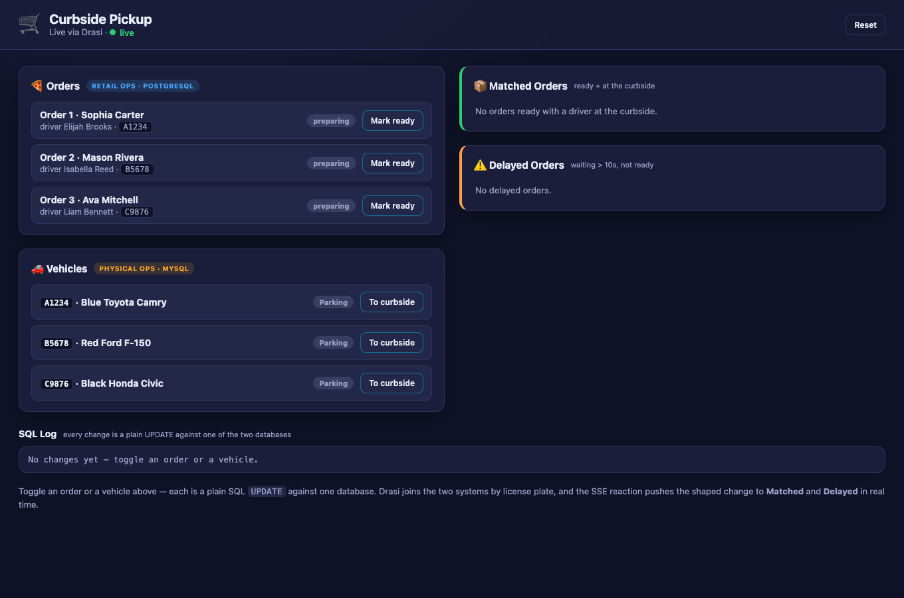
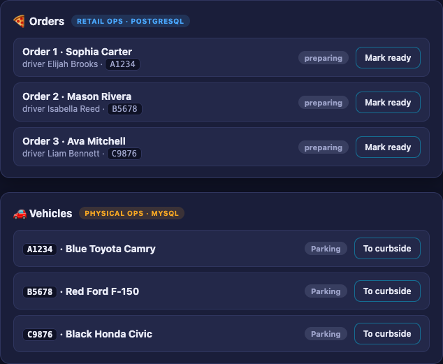
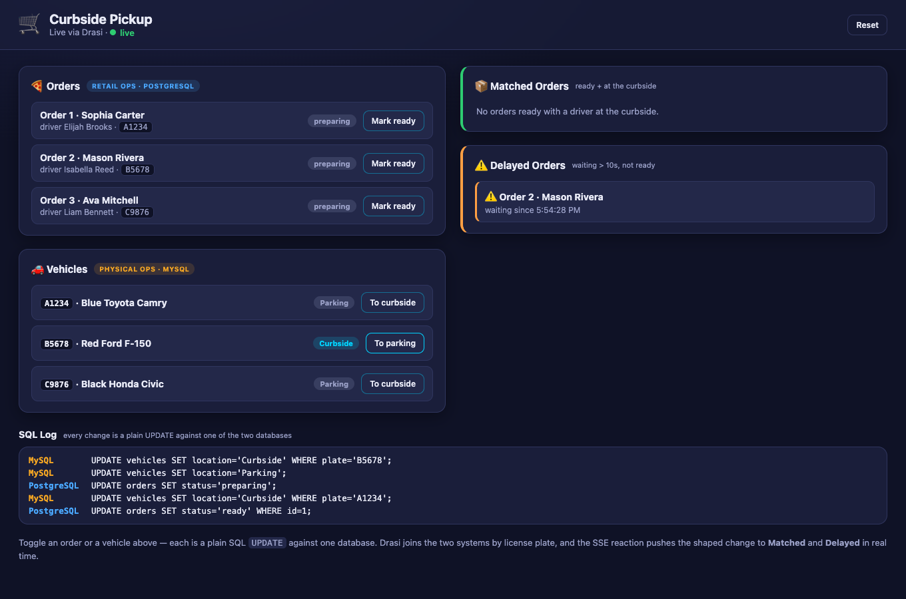

Imagine a store running curbside pickup. The **retail team** manages customer orders in one
database and marks an order *ready* when it's prepared. Independently, the **physical
operations team** tracks pickup vehicles in *another* database, and a driver sets their
location to *Curbside* when they arrive. The two systems never talk to each other.

You want a single live view with the panels that matter:

- **Orders** — every order in PostgreSQL, so one visibly flips from *preparing* to *ready*
  the moment it's marked ready,
- **Vehicles** — every vehicle in MySQL, so a car moves from *Parking* to *Curbside* as the
  driver pulls up, and the two situations that actually need a human:
- **Matched Orders** — lights up the instant an order is *ready* **and** its driver is at the
  curbside, so staff know exactly which order to carry out, and
- **Delayed Orders** — flags drivers who have been waiting at the curbside too long while their
  order still isn't ready.

The catch: the orders live in **PostgreSQL** and the vehicles live in **MySQL**, and what you
care about — a *ready* order whose driver has *arrived* — only exists when you combine a fact
from each. Building this the traditional way means **polling both databases**. Poll the orders
and look up each *ready* one's vehicle in the other database, and a car pulling up changes
nothing until your next orders poll happens to re-check it. Flip it around and poll the
vehicles, and now you're blind to an order flipping to *ready*. Either way you get reactivity
from **one** side and stale, interval-delayed lookups on the other.

This tutorial builds it on **`@drasi/lib`** instead — the Node.js library that embeds the Drasi
continuous-query engine directly in your process. A single Node app connects to *both*
databases, runs six continuous queries (two of which join across PostgreSQL and MySQL), and
streams the results to a live web UI over
[Server-Sent Events](https://developer.mozilla.org/en-US/docs/Web/API/Server-sent_events).
Drasi watches the change feed of both databases at once, so a change on **either** side
re-evaluates the join immediately — no polling, no blind side.

Unlike the [Drasi Server tutorial](https://github.com/drasi-project/learning-drasi-server) this
is based on, there is no separate server to run, no built-in *dashboard* reaction, and no
separate operations console. Instead, the app embeds the engine and adds Drasi's **SSE
reaction** (`kind: sse`): it shapes each query change with **Handlebars** templates and streams
it to the browser, driving **one integrated UI**. That single page is both the dashboard *and*
the console — it shows the four panels live **and** carries the buttons that change orders and
vehicles, printing every SQL statement it runs beneath them.

**What you'll build:** a running Node app that embeds Drasi over two databases and reacts to
changes in either one in real time, assembled from Drasi's three core building blocks:

<div class="flow-diagram">
  <div class="flow-step">
    <div class="flow-step__icon">
      <i class="fas fa-database"></i>
    </div>
    <div class="flow-step__label">Sources</div>
    <div class="flow-step__description">Connect to your data sources</div>
  </div>

  <div class="flow-arrow">
    <i class="fas fa-arrow-right"></i>
  </div>

  <div class="flow-step">
    <div class="flow-step__icon">
      <i class="fas fa-filter"></i>
    </div>
    <div class="flow-step__label">Continuous Queries</div>
    <div class="flow-step__description">Define what changes matter</div>
  </div>

  <div class="flow-arrow">
    <i class="fas fa-arrow-right"></i>
  </div>

  <div class="flow-step">
    <div class="flow-step__icon">
      <i class="fas fa-bolt"></i>
    </div>
    <div class="flow-step__label">Reactions</div>
    <div class="flow-step__description">Take action automatically</div>
  </div>
</div>

| Step | What You'll Do | Time |
| ---- | ------------- | ---- |
| **[Step 1: Set Up Your Environment](#setup)** | Open the dev container (or install Node + Docker locally) | 5 min |
| **[Step 2: Run the Demo](#run)** | One command starts both databases and the app | 3 min |
| **[Step 3: Open the UI](#ui)** | Watch orders, vehicles, matches, and delays live | 2 min |
| **[Step 4: Drive Change](#drive)** | Mark orders ready and move vehicles — and watch Drasi react instantly | 5 min |
| **[How It Works](#how)** | Understand the two sources, the cross-database join, the six queries, and the SSE reaction | 6 min |

{}
- **Terminal:** you'll use one to run the app (it stays in the foreground). Everything else
  happens in your **browser**. You can optionally use a second terminal for the helper scripts
  that change data.
- **Working directory:** run every command from the tutorial directory
  (`tutorials/curbside-pickup/`). The dev container opens there automatically; if you're
  running locally, `cd tutorials/curbside-pickup` first.
- **Ports:** the web UI is on `3000`, PostgreSQL is published on `5742`, and MySQL on `3309`.
  The SSE reaction runs inside the app on `8081`, but the app multiplexes it into the UI's
  `/events` stream, so only `3000` needs to be reachable.
{}

## Step 1 of 4: Set Up Your Environment {#setup}

This tutorial needs **Docker** (it runs PostgreSQL and MySQL) and **Node.js 18+**. The easiest
way to get everything is the **dev container**, which installs it all for you. You can also run
locally if you prefer.

### Option A: Dev Container or GitHub Codespaces (recommended)

1. Open the [`drasi-nodejs`](https://github.com/drasi-project/drasi-nodejs) repository in VS
   Code and run **Reopen in Container** (or create a **Codespace** from the repo's **Code**
   menu).
2. When prompted for a configuration, choose **Drasi Node.js — Curbside Pickup Tutorial**.
3. Wait for the container to finish. Its setup script installs Node dependencies for the
   tutorial.

That's it — skip ahead to [Step 2](#run).

### Option B: Run Locally

You'll need **Node.js 18+**, **Docker** (for PostgreSQL and MySQL), and **bash** (for the
optional helper scripts; on Windows use Git Bash or WSL). From the repository root, move into
the tutorial directory and install its dependencies:

```bash
cd tutorials/curbside-pickup
npm install
```

`@drasi/lib` ships **prebuilt binaries**, so there's no Rust toolchain to install — npm
resolves the correct native addon for your platform. (Intel macOS has no prebuilt binary and
must build from source; see the [library docs](https://drasi-project.github.io/drasi-nodejs/).)

## Step 2 of 4: Run the Demo {#run}

Everything runs from a single command. In your terminal, start the demo:

```bash
npm run demo
```

`npm run demo` does two things: it starts **PostgreSQL** (seeded with three orders, all
*preparing*) and **MySQL** (seeded with three vehicles, all *Parking* — the plates match the
orders), then runs the Node app in the foreground. MySQL comes up with **ROW-based binary
logging** and **GTID** mode enabled, and its init script grants the Drasi user the replication
privileges the source needs.

On first start, the app downloads the Drasi plugins it needs (`source/postgres`,
`bootstrap/postgres`, `source/mysql`, `bootstrap/mysql`, and `reaction/sse`) from
`ghcr.io/drasi-project` with `installPlugin`, which resolves each one to the build that matches your
platform **and** this library version, connects to both databases, bootstraps the existing rows, and
starts the six continuous queries and the SSE reaction. When you see this line, it's ready:

```text
✅ Curbside Pickup is ready — open http://localhost:3000
```

Leave this running. Everything else happens in your **browser** (or an optional second
terminal).

{}
Press **Ctrl+C** in the terminal to stop the app. To remove the database containers when you're
completely done, run `bash scripts/cleanup.sh` (add `--volumes` to also delete the data). The
databases keep running between app restarts, so you can stop and start the app freely.
{}

## Step 3 of 4: Open the UI {#ui}

The app serves its own web UI — there's no separate dashboard or console to build or run.
**Wait until the terminal prints `Curbside Pickup is ready`** (the first run takes a little
longer while the plugins download), then open it in your browser:

```text
http://localhost:3000
```

In the dev container or Codespaces, port `3000` is forwarded automatically — VS Code shows a
notification when the UI is ready, and you can also open it from the **Ports** panel (the
**Curbside UI** entry). If you open the page before the app has finished starting, just refresh
once it's ready.

You'll see the **Curbside Pickup** UI, a single page with everything on it:



- 🍕 **Orders** *(Retail Ops · PostgreSQL)* — every order, each with a badge (*preparing* /
  *ready*) and a button that toggles it. This is both a live panel **and** the control for the
  retail side.
- 🚗 **Vehicles** *(Physical Ops · MySQL)* — every vehicle, each with a badge (*Parking* /
  *Curbside*) and a toggle button — the control for the physical-operations side.
- 📦 **Matched Orders** — orders that are *ready* whose driver is at the *Curbside* (the
  `delivery` query). Starts empty.
- ⚠️ **Delayed Orders** — drivers who have waited at the curbside more than 10 seconds while
  their order is still being prepared (the `delay` query). Starts empty.
- **SQL Log** — every change you make is a plain `UPDATE` against one of the two databases; the
  log prints each statement, colour-coded by database, so you can see exactly what Drasi is
  reacting to.

The two left-hand panels are what you drive — each row is one operational record with its
current state and a single toggle button:



At bootstrap all three orders are *preparing* and all three vehicles are *Parking*, so the
**Matched** and **Delayed** panels start empty and fill in as you drive changes. Every panel
updates the instant the data changes — no refreshing.

## Step 4 of 4: Drive Change {#drive}

With the app running and the UI open, change orders and vehicles from the UI and watch Drasi
react.

{}
Every button in the UI does exactly one thing: a plain SQL `UPDATE` — against PostgreSQL for
orders, MySQL for vehicles — exactly what the real retail and physical-operations apps would
do. The button posts to the app, which runs the `UPDATE`; there's **no event to publish and no
call into Drasi**. Drasi observes the row change through PostgreSQL's logical replication and
MySQL's binary log, re-evaluates the affected queries, and the SSE reaction re-shapes and pushes
the change on its own. The **SQL Log** panel shows exactly which statement hit which database.
{}

### Trigger a delivery

In the 🍕 **Orders** panel, click **Mark ready** on order **1** (Sophia Carter, plate `A1234`) —
its badge flips to *ready*. Then, in the 🚗 **Vehicles** panel, click **To curbside** on vehicle
**A1234** (Sophia's Blue Toyota Camry).

Within about a second the 📦 **Matched Orders** panel lights up: order **1** appears with its
driver and vehicle. Nothing polled anything — Drasi saw the PostgreSQL change through logical
replication and the MySQL change through the binary log, and re-evaluated the cross-database
join. The **SQL Log** shows the two writes that drove it, one per database.


Move the vehicle back to *Parking* (or mark the order *preparing*) and the row disappears from
**Matched Orders** — the order is no longer matched to a waiting driver.

### Trigger a delay

Now reproduce the *other* scenario. Click **To curbside** on vehicle **B5678** (Mason Rivera's
Red Ford F-150), but **leave order 2 as *preparing***. Nothing happens immediately. After
**10 seconds** the ⚠️ **Delayed Orders** panel lights up: order **2** appears, flagging that the
driver has been waiting too long.



This is the interesting one. Drasi doesn't poll to find slow orders — the **continuous query
schedules its own future re-evaluation** for the moment the 10-second threshold is crossed, and
fires exactly then. If you mark the order *ready* (or send the driver back to *Parking*) before
the 10 seconds elapse, the alert never appears.

### Reset

Return everything to the starting state — all orders *preparing*, all vehicles *Parking* — with
the **Reset** button in the header. The **Matched** and **Delayed** panels clear.

{}
Because every change is just a database write, you can drive the same reactions with `psql` and
`mysql` from a second terminal — no app endpoint involved:

```bash
# Order (PostgreSQL / Retail Ops): mark order 1 ready
docker exec curbside-pickup-nodejs-postgres \
  psql -U drasi_user -d RetailOperations \
  -c "UPDATE orders SET status = 'ready' WHERE id = 1;"

# Vehicle (MySQL / Physical Ops): move A1234 to the curbside
docker exec curbside-pickup-nodejs-mysql \
  mysql -u drasi_user -pdrasi_password PhysicalOperations \
  -e "UPDATE vehicles SET location = 'Curbside' WHERE plate = 'A1234';"
```

Watch **Matched Orders** react exactly as if you had clicked the buttons.
{}

## How It Works {#how}

Everything you just ran is a single Node app under `tutorials/curbside-pickup/`. One file,
`index.mjs`, embeds the engine, builds the topology over both databases, wires the SSE
reaction, and serves the UI (the browser front end lives in `public/`). Here's what each part
does.

### Two Sources

The queries join data from two different databases, so the app declares two CDC sources:

**PostgreSQL** holds the orders and streams changes via **logical replication (CDC)**:

```js
await engine.addSource('postgres', 'retail-ops', {
  host: 'localhost',
  port: 5742,
  database: 'RetailOperations',
  user: 'drasi_user',
  password: 'drasi_password',
  tables: ['orders'],
  slotName: 'drasi_curbside_slot',
  publicationName: 'drasi_curbside_pub',
  tableKeys: [{ table: 'orders', keyColumns: ['id'] }],
}, true, { kind: 'postgres', config: /* same */ });
```

**MySQL** holds the vehicles and streams changes via its **binary log (binlog)**. The tutorial
container has no TLS, so the source connects with `sslMode: 'disabled'`, and the MySQL bootstrap
provider takes its own connection block:

```js
await engine.addSource('mysql', 'physical-ops', {
  host: 'localhost',
  port: 3309,
  database: 'PhysicalOperations',
  user: 'drasi_user',
  password: 'drasi_password',
  sslMode: 'disabled',
  tables: ['vehicles'],
  tableKeys: [{ table: 'vehicles', keyColumns: ['plate'] }],
}, true, { kind: 'mysql', config: /* the bootstrap provider's own settings */ });
```

Each table row becomes a graph node: `orders` rows become `orders` nodes and `vehicles` rows
become `vehicles` nodes, matching the `(o:orders)` and `(v:vehicles)` patterns in the queries.

### The Synthetic Join

There is no foreign key between the two databases — they're completely separate systems. Drasi
creates the relationship in the query with a **synthetic join**, matching a vehicle to an order
whenever their `plate` values are equal:

```js
const PICKUP_BY = {
  id: 'PICKUP_BY',
  keys: [
    { label: 'vehicles', property: 'plate' },
    { label: 'orders', property: 'plate' },
  ],
};
```

The join queries then walk that relationship with `(o:orders)-[:PICKUP_BY]->(v:vehicles)` as if
it were a real graph edge — across two different databases.

### The Six Continuous Queries

Four of the queries are simple single-source lists, filtered by state. Because each one matches
only part of the table, a row leaves one query's result and joins another's the instant its
status or location changes — which is what makes it move between panels. `orders-preparing` and
`orders-ready` split the PostgreSQL orders by status:

```cypher
MATCH (o:orders)
WHERE o.status <> 'ready'          // orders-ready uses: o.status = 'ready'
RETURN
  o.id AS id,
  o.id AS orderId,
  o.customer_name AS customerName,
  o.driver_name AS driverName,
  o.plate AS plate,
  o.status AS status
```

and `vehicles-parking` and `vehicles-curbside` split the MySQL vehicles by location:

```cypher
MATCH (v:vehicles)
WHERE v.location = 'Parking'        // vehicles-curbside uses: v.location = 'Curbside'
RETURN
  v.plate AS id,
  v.plate AS plate,
  v.make AS make,
  v.model AS model,
  v.color AS color,
  v.location AS location
```

The other two join across both databases. **`delivery`** returns an order whenever it is
*ready* and its driver's vehicle is at the *Curbside*. Because every order starts *preparing*
and every vehicle starts *Parking*, a row only appears once real changes move an order to ready
and a vehicle to curbside — so the panel starts empty and fills in as changes are driven live:

```cypher
MATCH (o:orders)-[:PICKUP_BY]->(v:vehicles)
WHERE o.status = 'ready'
AND v.location = 'Curbside'
RETURN
  o.id AS id,
  o.id AS orderId,
  o.driver_name AS driverName,
  o.plate AS vehicleId,
  v.make AS vehicleMake,
  v.model AS vehicleModel,
  v.color AS vehicleColor,
  drasi.listMax([drasi.changeDateTime(o), drasi.changeDateTime(v)]) AS readyTimestamp
```

**`delay`** returns an order whose driver has been at the *Curbside* for more than 10 seconds
while the order still isn't *ready*. It uses **`drasi.trueFor`**, which schedules a future
re-evaluation and fires the moment the condition has held for the given duration, so the order
appears exactly when the 10-second threshold is crossed:

```cypher
MATCH (o:orders)-[:PICKUP_BY]->(v:vehicles)
WHERE o.status <> 'ready'
AND drasi.trueFor(v.location = 'Curbside', duration({ seconds: 10 }))
RETURN
  o.id AS orderId,
  o.customer_name AS customerName,
  drasi.changeDateTime(v) AS waitingSinceTimestamp
```

{}
Both the PostgreSQL and MySQL sources stamp every change with the wall-clock time it happened,
which `drasi.changeDateTime()` exposes. `drasi.trueFor` uses that timestamp to anchor its
10-second timer — so the delay query fires exactly when a curbside vehicle has waited long
enough — and the delay panel reports it as `waitingSinceTimestamp`, with no extra timestamp
columns or application bookkeeping required.
{}

All six queries are registered the same way, each with the sources it reads and (for the join
queries) the `PICKUP_BY` join:

```js
await engine.addQuery('delivery', deliveryCypher,
  ['retail-ops', 'physical-ops'], 'cypher', [PICKUP_BY]);
```

### The SSE Reaction (`kind: sse`)

This is where the Node version differs most from the Drasi Server tutorial's *dashboard*
reaction — but it's the **same built-in SSE reaction** the
[Getting Started tutorial](https://github.com/drasi-project/learning-drasi-server) uses. The
app loads the `reaction/sse` plugin from the OCI registry and adds it with
[`addReaction`](https://drasi-project.github.io/drasi-nodejs/docs/api/). The reaction opens an
HTTP endpoint and streams each subscribed query's result **changes** to the browser over
Server-Sent Events.

Crucially, the SSE reaction shapes each change with a **Handlebars template** before sending it
— no reaction code of our own required. Each query gets its own `routes` entry with `added` /
`updated` / `deleted` templates that rename the raw query columns into the clean JSON contract
the UI wants:

```js
await engine.addReaction('sse', 'curbside-sse', Object.keys(routes), {
  host: '0.0.0.0',
  port: 8081,
  heartbeatIntervalMs: 15000,
  routes: {
    delivery: {
      added:   { path: '/delivery', template: '{"op":"add","row":{"id":{{json after.id}},"orderId":{{json after.orderId}},"driverName":{{json after.driverName}}, ... }}' },
      updated: { path: '/delivery', template: '{"op":"update","row":{ ... }}' },
      deleted: { path: '/delivery', template: '{"op":"delete","row":{"id":{{json before.id}}}}' },
    },
    // ...one entry per streamed query (orders-preparing, orders-ready,
    //    vehicles-parking, vehicles-curbside, delay)
  },
});
```

`{{json ...}}` is one of the reaction's Handlebars helpers; it serializes each value as valid
JSON. In the code, a small `sseRoute(path, shape)` helper turns each query's row *shape* into
those templates, and the same shapes drive a matching reshaper for the initial snapshot — so the
browser sees an identical payload whether it arrives as a live change or in the seed.

Because SSE only carries **changes from the moment a client connects**, the app also serves the
current state once at `GET /api/state` (built from `getQueryResults`, shaped through the same
contract). The browser seeds from that snapshot, then applies live deltas.

Finally, the SSE reaction serves each query on its own route. Rather than have the browser open
one `EventSource` per route — which, with the browser's ~6-connections-per-host HTTP/1.1 limit,
would eat into the connections the control `fetch()`es need — the app opens all of those routes
itself and **multiplexes** them into a **single** same-origin stream at `GET /events`.
Each forwarded event is tagged with its stream path
(`{ "path": …, "msg": { op, row } }`). Node has no such per-host limit, and only one port needs
forwarding in Codespaces or a dev container.

### The Integrated UI

The front end (`public/`) is a single HTML page with vanilla CSS and JavaScript — no build
step. On load it seeds itself from `/api/state`, then opens one `EventSource` at `/events` and
merges each `{ op, row }` change into the map for its `path`:

```js
const source = new EventSource('/events');
source.onmessage = (e) => {
  const { path, msg } = JSON.parse(e.data); // path names the stream
  const { op, row } = msg;
  const map = state[path];
  if (op === 'delete') map.delete(row.id);
  else map.set(row.id, row);
  render();
};
```

It renders the four panels straight from those streams — **Orders** and **Vehicles** are each
the union of their two filtered queries, and **Matched** / **Delayed** come from the join and
temporal queries. Each row is produced by a small template literal that maps the shaped fields
onto markup. The order row is representative — it carries the toggle button, tagged with the
`data-order` attribute the click handler reads to know what to update:

```js
function orderRow(o) {
  const ready = o.status === "ready";
  const next = ready ? "Mark preparing" : "Mark ready";
  return `<li class="row">
    <div class="row__main">
      <div class="row__title">Order ${escapeHtml(o.orderId)} · ${escapeHtml(o.customerName)}</div>
      <div class="row__sub">driver ${escapeHtml(o.driverName)} · <span class="plate">${escapeHtml(o.plate)}</span></div>
    </div>
    <div class="row__right">
      <span class="badge badge--${escapeAttr(o.status)}">${escapeHtml(o.status)}</span>
      <button class="btn btn--go" data-order="${escapeAttr(o.id)}">${next}</button>
    </div>
  </li>`;
}
```

The vehicle row follows the same shape (its button carries `data-vehicle`), while the
**Matched** and **Delayed** rows are read-only variants with no button — the delayed row, for
example, just shows the order and how long the driver has been waiting. The order and vehicle
toggle buttons post to the app's small control
endpoints (`POST /api/orders/:id/toggle`, `POST /api/vehicles/:plate/toggle`, `POST /api/reset`),
which run plain `UPDATE` statements against PostgreSQL and MySQL and record
each one in the SQL log the page shows. So a click becomes a database change that Drasi observes
through CDC, re-runs the affected queries, and the SSE reaction pushes the shaped change back to
the browser — closing the loop, all on the same page.

## Clean Up {#cleanup}

When you're finished, stop the app with **Ctrl+C**, then remove the database containers:

```bash
# Stop containers, keep data
bash scripts/cleanup.sh

# Stop containers and delete the data volumes
bash scripts/cleanup.sh --volumes
```

## What You Learned {#summary}

- **Sources** connect Drasi to live data — here, **two** of them at once: PostgreSQL via
  logical replication and MySQL via its binary log, both embedded in a single Node app with
  `@drasi/lib`.
- **Continuous Queries** with a **synthetic join** relate rows across two completely separate
  databases (`vehicles.plate = orders.plate`), and **`drasi.trueFor`** adds real-time temporal
  logic — the delay fires exactly when the threshold is crossed, with no polling or timers of
  your own.
- **Reactions** turn query changes into action. Drasi's **SSE reaction** (`kind: sse`) shaped
  each change with **Handlebars** templates and streamed it over **Server-Sent Events** to a
  custom UI — full control over the markup, with no reaction code of your own.
- One **integrated UI** both drives the changes (plain SQL `UPDATE`s that Drasi observes through
  CDC) and shows them live, so the whole "two independent systems, one live view" story fits on
  a single page.

From here, try changing the delay threshold, editing the Handlebars templates, adding another
cross-source query, or pointing the app at your own data — it's all in one file, `index.mjs`.
