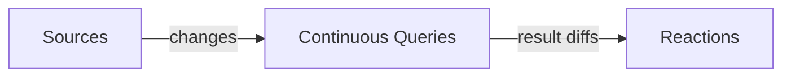

`@drasi/lib` embeds the [Drasi](https://drasi.io) continuous-query engine inside
your Node.js process. To use it well, it helps to understand three building blocks
— **sources**, **continuous queries**, and **reactions** — and the change-driven
model that ties them together.

## The change-driven model

Traditional applications *pull*: you run a query, get an answer, and it's stale the
moment the data changes. To stay current you poll, diff, and re-run.

Drasi flips this around. You declare a **continuous query** once, and the engine
keeps its result set continuously up to date as the underlying data changes. Rather
than re-running the query, Drasi tells you exactly what changed — which rows were
**added**, **updated**, or **removed**.



Everything runs **in-process**: the engine, the queries, and your JavaScript
sources and reactions all live in the same Node.js process. There is no external
server, message broker, or database required for the engine itself.

## Sources

A **source** feeds changes into the engine as a stream of graph elements — **nodes**
(with labels and properties) and **relations** (edges between nodes). Drasi models
all incoming data as a property graph so a single query can span multiple sources.

`@drasi/lib` gives you two kinds of source:

- **JavaScript sources** — created with [`addJsSource`](../api/#addjssourceid-autostart)
  and driven by your own code via [`pushChange`](../api/#pushchangesourceid-change).
  Use these to feed the engine from an event stream, a webhook, database CDC, or any
  data your application already has. No Rust required. See
  [JavaScript sources](../guides/js-sources/).
- **Native plugin sources** — self-contained cdylib plugins (the same ones
  `drasi-server` uses) that connect to external systems such as PostgreSQL. Load
  them from a directory with [`loadPlugins`](../api/#loadpluginsdir-verify) or pull
  them from an OCI registry. See [Working with plugins](../guides/plugins/).

A source may also have a **bootstrap** provider that gives newly subscribed queries
an initial snapshot of existing data before live changes start flowing.

## Continuous queries

A **continuous query** is a declarative query — written in **Cypher** (the default)
or **GQL** — over one or more sources. Once added with
[`addQuery`](../api/#addqueryid-query-sources-language-joins), the engine maintains
its result set incrementally: as sources emit changes, Drasi computes the minimal
set of result rows that were added, updated, or removed and makes them available to
reactions.

```js
await drasi.addQuery(
  'hot-sensors',
  'MATCH (s:SensorReading) WHERE s.temperature > 25 RETURN s.sensor_id AS sensor, s.temperature AS temp',
  ['sensors'],
);
```

You can read a query's current result set at any time with
[`getQueryResults`](../api/#getqueryresultsid).

### Synthetic joins

Sometimes you need to relate elements across sources — or within one source — that
have no explicit relationship (no foreign key, no edge). **Synthetic joins** let the
query define those relationships from matching property values, entirely inside the
engine:

```js
await drasi.addQuery(
  'watchlist',
  'MATCH (w:Watchlist)-[:ON_WATCHLIST]->(s:Stock)-[:HAS_PRICE]->(p:Price) RETURN ...',
  ['watchlist', 'stocks', 'prices'],
  'cypher',
  [
    { id: 'ON_WATCHLIST', keys: [{ label: 'Watchlist', property: 'symbol' }, { label: 'Stock', property: 'symbol' }] },
    { id: 'HAS_PRICE',    keys: [{ label: 'Stock', property: 'symbol' }, { label: 'Price', property: 'symbol' }] },
  ],
);
```

## Reactions

A **reaction** consumes a query's result changes and does something with them.
`@drasi/lib` offers:

- **JavaScript reactions** — a plain callback registered with
  [`addJsReaction`](../api/#addjsreactionid-queryids-callback). It receives a
  `QueryResultEvent` for each non-empty batch of changes. This is the simplest way
  to wire query results into your application. See
  [JavaScript reactions](../guides/js-reactions/).
- **Durable JavaScript reactions** — an async callback registered with
  [`addDurableJsReaction`](../api/#adddurablejsreactionid-queryids-callback-options).
  The engine checkpoints progress to a persistent state store so a restart resumes
  after the last checkpoint. Use these when missing a change on a crash is not
  acceptable.
- **Native plugin reactions** — cdylib reaction plugins added with
  [`addReaction`](../api/#addreactionkind-id-queryids-config).

### Result diffs

Both JavaScript reaction styles receive a `QueryResultEvent`:

```ts
{ query_id: string, sequence: number, timestamp: string,
  results: ResultDiff[], metadata: Record<string, unknown> }
```

Each `ResultDiff` in `results` is a tagged union on `type`:

| `type` | Payload | Meaning |
| --- | --- | --- |
| `ADD` | `{ data }` | A row entered the result set. |
| `UPDATE` | `{ before, after }` | A row's values changed. |
| `DELETE` | `{ data }` | A row left the result set. |
| `aggregation` | `{ before?, after }` | An aggregated value (e.g. `GROUP BY`) changed. |
| `noop` | — | No effective change. |

```js
await drasi.addJsReaction('handle', ['hot-sensors'], (event) => {
  for (const diff of event.results) {
    if (diff.type === 'ADD') console.log('HOT:', diff.data);
    else if (diff.type === 'UPDATE') console.log('CHANGED:', diff.after);
    else if (diff.type === 'DELETE') console.log('COOLED:', diff.data);
  }
});
```

## Lifecycle & ordering

An engine is created with [`Drasi.create`](../api/#drasicreateid-options-static),
started with [`start`](../api/#start), and released with [`close`](../api/#close).

A useful rule of thumb: **call `start()` first, then add components.** Components
added to a running engine auto-start individually. Adding everything first and then
calling `start()` also works — both orderings are supported.

For a fully declarative setup, [`Drasi.fromConfig`](../api/#drasifromconfigconfig-static)
builds **and starts** an engine from a single config object describing plugins,
sources, queries, and reactions.

## Where to go next

- [API reference](../api/) — the complete `Drasi` class surface.
- [Getting Started](../getting-started/) — install and run your first query.
- [Trading demo](../examples/trading/) — these concepts applied end to end.
