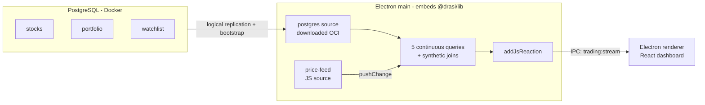

The **trading demo** is a self-contained desktop app that embeds `@drasi/lib` and
renders **live** query results in its own window — no browser, no HTTP/SSE, no REST,
no Python. It's a faithful port of `drasi-server`'s
[`examples/trading`](https://github.com/drasi-project/drasi-server/tree/main/examples/trading)
demo, and it's the best way to see every concept in this documentation working
together.

The full source is in
[`examples/trading`](https://github.com/drasi-project/drasi-nodejs/tree/main/examples/trading).

## What it demonstrates

- **Real PostgreSQL CDC** — reference data (`stocks`, `portfolio`, `watchlist`) lives
  in a real Postgres database and is streamed into the engine via Drasi's Postgres
  source (logical replication) plus a Postgres bootstrap snapshot.
- **Synthetic joins** — `HAS_PRICE`, `OWNS_STOCK`, and `ON_WATCHLIST` relate elements
  across sources (and across a database and a live feed) with **no foreign keys**,
  entirely inside the query. See [Concepts → Synthetic joins](../../concepts/#synthetic-joins).
- **In-process price feed** — a tiny Node random-walk generator pushes `stock_prices`
  into a [JavaScript source](../../guides/js-sources/).
- **Application reactions** — one [`addJsReaction`](../../api/#addjsreactionid-queryids-callback)
  per query streams result diffs straight to the renderer over a single IPC channel;
  the dashboard merges ADD/UPDATE/DELETE/aggregation diffs into live tables.
- **Plugins downloaded at runtime** — the Postgres source and bootstrap plugins are
  pulled from `ghcr.io/drasi-project` on first launch and cached locally. Nothing is
  baked in. See [Working with plugins](../../guides/plugins/).

## Architecture



The native addon is N-API v9 (ABI-stable), so it loads directly in Electron's main
process with no `electron-rebuild`.

## The queries

Five continuous queries power the dashboard panels. Their definitions live in
[`src/shared/queries.ts`](https://github.com/drasi-project/drasi-nodejs/blob/main/examples/trading/src/shared/queries.ts)
and are ported verbatim from the upstream demo:

| Panel | Demonstrates |
| --- | --- |
| **Watchlist** | 3-way synthetic join across two sources (`watchlist → stocks → stock_prices`) + computed change % |
| **Portfolio P&amp;L** | Multi-source join + computed fields (value, P&amp;L, P&amp;L %) recomputed on every tick |
| **Top Gainers** | `WHERE` filtering that re-evaluates as prices move |
| **Sector Performance** | Real-time `GROUP BY` aggregation (count / sum / min / max) |
| **Price Ticker** | Single-source, high-frequency feed (no joins) |

## Prerequisites

- **Docker Desktop** running (for the PostgreSQL database).
- **Network access on first launch** (to download the Postgres plugins from
  `ghcr.io/drasi-project`; cached afterwards).
- The root `@drasi/lib` package built first.

## Run it

```bash
# 1. Build the @drasi/lib addon from the repository root.
git clone https://github.com/drasi-project/drasi-nodejs.git
cd drasi-nodejs
npm install
npm run build

# 2. Start the demo.
cd examples/trading
npm install
npm run db:up      # start PostgreSQL (waits until healthy)
npm run dev        # launch the Electron app
```

Stock prices start moving immediately; the panels update live as joins and
aggregations recompute. When you're done:

```bash
npm run db:down    # stop PostgreSQL and remove its volume
```

## How it maps to the upstream demo

| Upstream (drasi-server trading) | This example |
| --- | --- |
| PostgreSQL via docker-compose (`wal_level=logical`) | Same (`database/docker-compose.yml` + trimmed `init.sql`) |
| `postgres-stocks` CDC source + `postgres` bootstrap | Same plugins, **downloaded from OCI at startup** |
| HTTP price feed + Python generator | In-process Node random-walk → JavaScript source `price-feed` |
| SSE reaction + browser `EventSource` | `addJsReaction` → single IPC channel → renderer |
| REST API to create queries/reactions | Direct engine calls in `main` at startup |

## What to read next

- [Concepts](../../concepts/) — the model behind the demo.
- [JavaScript sources](../../guides/js-sources/) and
  [reactions](../../guides/js-reactions/) — the two building blocks the demo wires up.
- [Working with plugins](../../guides/plugins/) — how the Postgres plugins are pulled
  and loaded.
